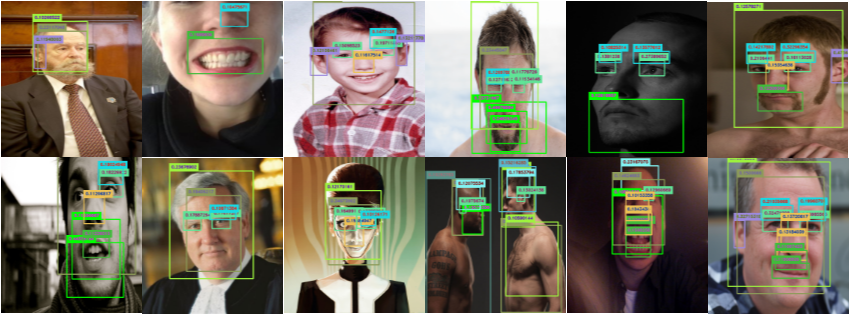

# Detect human parts (PARTNet)
[]()
[]()
[]()
[]()

<p align="center">
  
</p>

           

## Lastest Releases

[v1.3.0](https://github.com/claudemircasa/human_parts/releases/tag/v1.3.0)
[v1.2.0](https://github.com/claudemircasa/human_parts/releases/tag/v1.2.0)
[v1.1.0](https://github.com/claudemircasa/human_parts/releases/tag/v1.1.0)
[v1.0.0](https://github.com/claudemircasa/human_parts/releases/tag/v1.0.0)

## What is PARTNet
PARTNet is a compact model trained to be faster and smaller.
The initial idea of this project is train a model to detect human head parts and expand to the entire human body.
Our model is trained over [ONNX](http://onnx.ai), this allows the model to be executed in real time on mobile devices and embedded devices, it also allows the model to be converted to other neural network architectures.
The model is not as accurate as a full model, but it's being constantly updated for best results.

## What is ONNX?
The Open Neural Network eXchange ([ONNX](http://onnx.ai)) is an open format to represent deep learning models. With ONNX, developers can move models between state-of-the-art tools and choose the combination that is best for them. ONNX is developed and supported by a community of partners.

## Model Visualization
You can see visualizations of each model's network architecture by using [Netron](https://lutzroeder.github.io/Netron) or [VisualDL](http://visualdl.paddlepaddle.org/).

### Run samples
We offer the model in 3 different formats: ONNX, CoreML and TensorFlow. Download according to the last registered timestamp, the format is: **dd_mm_yyyy__hh_mm_ss**. To execute them simply unzip the specific file and run the command:

```bash
python python/onnxruntime_predict.py <image_file>
```
or

```bash
python python/predict.py <image_file>
```

[](https://lutzroeder.github.io/Netron)
[](http://visualdl.paddlepaddle.org/)

## Statistics
[]()
[]()
[]()

<p align="center">


</p>

These are the statistics of the last iteration performed. They are based on a subsample of the original image database that contains 60,000 images.

### Performance Per Tag

| Probability Threshold | Overlap Threshold |
| --- | --------- |
| 50% | 30% |

| Tag | Precision | Recall | A.P. | Image Count |
| --- | --------- | ------ | ---- | ----------- |
| Human beard |	78.9% |	13.0% |	36.4%	| 5058 |
| Man	| 43.3%	| 1.2%	| 13.7%	| 5155 |
| Woman	| 40.0%	| 0.6%	| 10.7%	| 5116 |
| Human ear |	38.5% |	0.4%	| 5.2%	| 5138 |
| Human eye |	28.6%	| 0.1%	| 4.7%	| 5202 |
| Human face |	10.0%	| 0.0%	| 7.1%	| 5185 |
| Human mouth |	0.0%	| 0.0%	| 2.9%	| 5207 |
| Human forehead |	0.0% | 0.0%	| 4.8%	| 5103 |
| Human hair |	0.0%	| 0.0%	| 5.5%	| 5187 |
| Human nose |	0.0%	| 0.0%	| 2.3%	| 5211 |
| Human eyebrow |	0.0%	| 0.0%	| 4.4%	| 5142 |
| Human head | 0.0%	| 0.0%	| 6.1%	| 5220 |

## Dataset
We use a subset of images extracted from Google Open Images Dataset V5 ([OIDV5](https://storage.googleapis.com/openimages/web/factsfigures.html)) containing 60,000 images that were randomly extracted using the [OIDv4_ToolKit tool](https://github.com/EscVM/OIDv4_ToolKit). 
The database is really great, if you have interest contact us by [email](mailto:claudemir.casa@ufpr.br).

## Contributions
Do you want to contribute? To get started, choose the latest version of the template above, retrain, if you get better results with the same image database it will be published here.

## License
[](LICENSE)

MIT License. Copyright (c) 2019 IMAGO Research Group.

## Authors
[Claudemir Casa](claudemir.casa)

## Collaborators
Special thanks to my lab colleagues.

[Jhonatan Souza](https://github.com/xkiddie)
[Tiago Mota de Oliveira](https://github.com/tiufsc)
